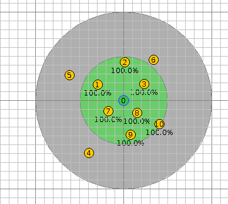
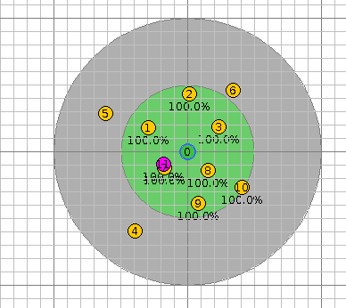
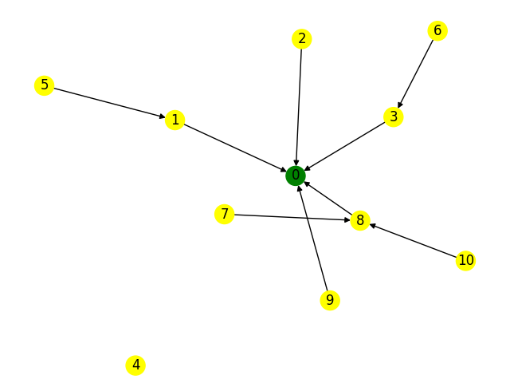
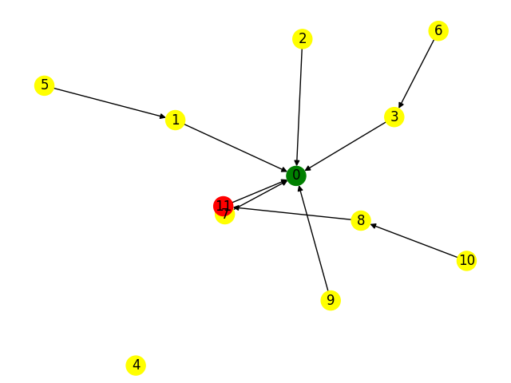
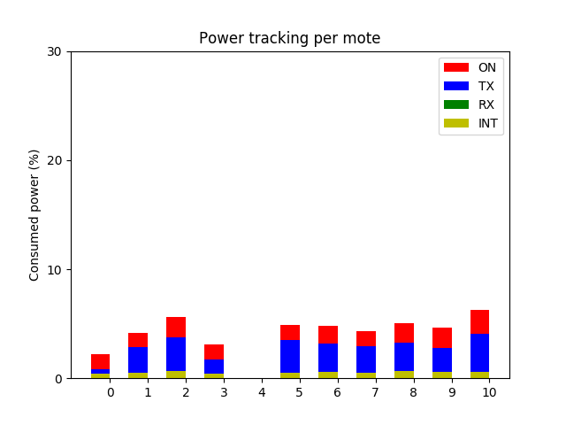
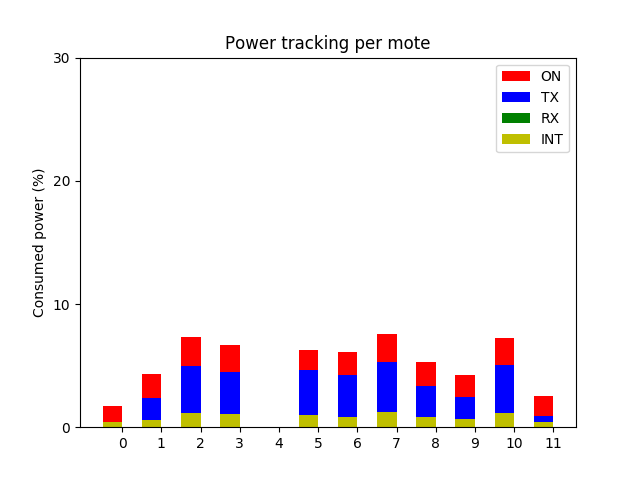

 <h1>Simulation Report</h1> 

## Decreased Rank Attack

### 1. Introduction

**Goal**: Demonstrate that this attack impacts the DODAG by channeling multiple links through the malicious node.
With the modified RPL configuration constant, the malicious node will advertise a better rank than neighbors, causing the DAG to be modified. This attack does not damage a network, however, combining with other building blocks could be very effective because it allows the attacker to tunnel some traffic through the malicious node (e.g. for eavesdropping).

### 2. Configuration

#### Wireless Sensor Network

The simulation lasts 120 seconds and is not repeated.

The WSN contains:

- 1 root node of type *root-echo* built upon a *Z1*
- 10 sensors of type *sensor-echo* built upon a *Z1*
- 1 malicious mote of type *malicious-sensor* built upon a *Z1*

The sensors are spread across an area of 200.0 meters side and centered around the root node at a minimum distance of 20.0 meters and a maximum distance of 200.0 meters. They have a maximum transmission range of 50.0 meters and a maximum interference range of 100.0 meters.

The WSN configuration is depicted in Figures 1 and 2:

  <figure>
    
    <figcaption>Fig 1 - WSN configuration without the malicious mote before starting the simulation.</figcaption>
  </figure> 

  <figure>
    
    <figcaption>Fig 2 - WSN configuration with the malicious mote before starting the simulation.</figcaption>
  </figure> 

#### Attack

The attack is composed of the following building blocks:

- decreased-rank

### 3. Results

In this section, the pictures on the left side corresponds to the results for the simulation without the malicious mote. These on the left are for the simulation with the malicious mote.

#### Resulting DODAG

The resulting Destination Oriented Directed Acyclic Graph (DODAG) is depicted in the following pictures:

  <figure>
    
    <figcaption>Fig 3 - Final DODAG for the simulation without the malicious mote.</figcaption>
  </figure> 

  <figure>
    
    <figcaption>Fig 4 - Final DODAG for the simulation with the malicious mote.</figcaption>
  </figure> 

<textarea>
On the left, one can see a typical construction of DODAG (at a time when this is maybe not stable yet and with potentially non-optimal links). On the right side, one can easily observe that the traffic is channeled through the malicious node.
</textarea>

> **Important note**: The resulting DODAG's could be not representative if the duration is not long enough. Ensure that it is set appropriately.

#### Power Tracking Analysis

The power tracking is depicted in the following pictures:

  <figure>
    
    <figcaption>Fig 5 - Power tracking histogram for the simulation without the malicious mote.</figcaption>
  </figure> 

  <figure>
    
    <figcaption>Fig 6 - Power tracking histogram for the simulation with the malicious mote.</figcaption>
  </figure> 

<textarea>
The power consumption does not tell anything relevant as this attack is not aimed to cause energy exhaustion.
</textarea>
