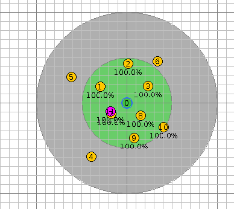

 <h1>Simulation Report</h1> 

## Flooding Attack

### 1. Introduction

**Goal**: Demonstrate that this kind of attack can dramatically impact a WSN through an important energy exhaustion.
While entering the WSN, thanks to the ContikiRPL configuration constants set with the building block, the malicious node immediately starts sending DIS messages to its neighbors, then triggering DIO messages and trickle timers reset.

### 2. Configuration

#### Wireless Sensor Network

The simulation lasts 120 seconds and is not repeated.

The WSN contains:

- 1 root node of type *root-dummy* built upon a *Z1*
- 10 sensors of type *sensor-dummy* built upon a *Z1*
- 1 malicious mote of type *malicious-sensor* built upon a *Z1*

The sensors are spread across an area of 200.0 meters side and centered around the root node at a minimum distance of 20.0 meters and a maximum distance of 200.0 meters. They have a maximum transmission range of 50.0 meters and a maximum interference range of 100.0 meters.

The WSN configuration is depicted in Figures 1 and 2:

  <figure>
    
    <figcaption>Fig 1 - WSN configuration without the malicious mote before starting the simulation.</figcaption>
  </figure> 

  <figure>
    
    <figcaption>Fig 2 - WSN configuration with the malicious mote before starting the simulation.</figcaption>
  </figure> 

#### Attack

The attack is composed of the following building blocks:

- hello-flood

### 3. Results

In this section, the pictures on the left side corresponds to the results for the simulation without the malicious mote. These on the left are for the simulation with the malicious mote.

#### Resulting DODAG

The resulting Destination Oriented Directed Acyclic Graph (DODAG) is depicted in the following pictures:

  <figure>
    
    <figcaption>Fig 3 - Final DODAG for the simulation without the malicious mote.</figcaption>
  </figure> 

  <figure>
    
    <figcaption>Fig 4 - Final DODAG for the simulation with the malicious mote.</figcaption>
  </figure> 

<textarea>
As it can be seen, the malicious node (in violet) impacts nodes in its transmission range. One can now illustrate the attack efficiency using   this information to compare the power consumption in the simulation without (on the left) and with the malicious node (on the right).
</textarea>

> **Important note**: The resulting DODAG's could be not representative if the duration is not long enough. Ensure that it is set appropriately.

#### Power Tracking Analysis

The power tracking is depicted in the following pictures:

  <figure>
    
    <figcaption>Fig 5 - Power tracking histogram for the simulation without the malicious mote.</figcaption>
  </figure> 

  <figure>
    
    <figcaption>Fig 6 - Power tracking histogram for the simulation with the malicious mote.</figcaption>
  </figure> 

<textarea>
As it can easily be observed, nodes in the range of the malicious sensor are particularly impacted by the attack in terms of ON and RX times.  <b>Important note</b>: However, these nodes are not impacted in term of TX time. The reason is that upon the reception of a DIS, the nodes reset immediately send a DIO, due to the multicast nature of the sent DIS.  <b>Variant of the attack</b>: Another way of performing a flooding attack can be to unicast DIS to the neighbors, immediately triggering a DIO in response but not the trickle timer reset. This behavior can be verified in the ContikiRPL library, inside the file <pre>rplicmp6.c</pre>, in <pre>dis_input(void)</pre>.
</textarea>
